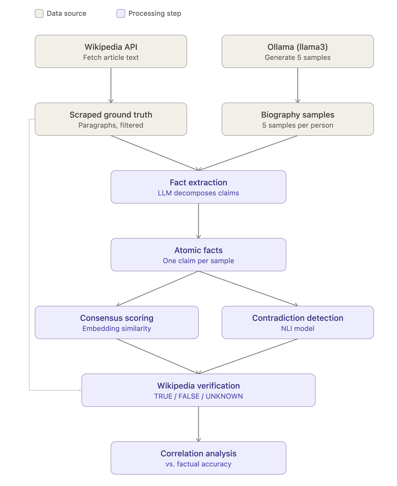

# LLM Hallucination Detection: Three Methods Compared

A small experiment comparing three different approaches to detecting LLM hallucination — sampling consistency (SelfCheckGPT-style), NLI-based semantic contradiction, and self-evaluation confidence — using biographies of 20 real but lesser-known notable people, verified against Wikipedia.

## Hypothesis

If a model actually "knows" a fact, it should express that fact consistently across independent samples. If it's hallucinating, different samples should drift, contradict each other, or hedge differently because there's no real underlying knowledge anchoring the generation, just plausible-sounding text.

This is the core idea behind SelfCheckGPT (Manakul et al.): you don't need access to model internals or a reference answer to flag likely hallucinations — you just need to sample the same prompt multiple times and measure how much the outputs agree with each other.

The obvious limitation, which this project ended up demonstrating directly rather than just assuming: a model that is *consistently* wrong will pass a self-consistency check every time, since agreement across samples isn't the same thing as agreement with reality.

Because of that limitation, this project also tests two other approaches on the same data: whether facts that *do* get repeated across samples logically contradict each other (semantic contradiction, via NLI), and whether the model's own stated confidence in its output — asked directly, single-pass, no sampling — tracks actual accuracy (self-evaluation confidence, following Kadavath et al.).

## Setup

- 20 real, Wikipedia-documented but not household-famous people (scientists, Nobel laureates, one politician)
- 5 biography samples generated per person, locally, via Ollama (llama3), at temperature 0.8
- Ground truth: scraped Wikipedia intro/article text via the Wikipedia API

## Pipeline

1. **Scrape ground truth** — pull each person's Wikipedia article text via the Wikipedia API, split into paragraphs, filter out section headers and short fragments.
2. **Generate biographies** — same prompt, 5 samples per person, non-zero temperature so samples can actually diverge.
3. **Extract atomic facts** — decompose each biography into single, checkable claims (one date, place, or achievement per fact) using an LLM extraction pass.
4. **Score consensus** — embed all facts per person (sentence-transformers), cluster near-duplicate phrasings, and compute what fraction of the 5 samples support each fact that was mentioned more than once. Facts mentioned only once are excluded from scoring — they carry no consistency information either way, and including them was found to conflate "hallucination" with "one sample being more verbose than the others."
5. **Detect contradictions** — an early version tried to flag contradictions using embedding similarity bands (facts that are topically close but phrased differently). This didn't work well: cosine similarity captures topical relatedness, not logical conflict, so it mostly caught paraphrases of the same fact and missed real conflicts (e.g. two different named institutions for the same degree). Replaced with an NLI model (`cross-encoder/nli-deberta-v3-base`) that directly classifies whether one fact contradicts another.
6. **Verify against ground truth** — for each fact, find the most relevant Wikipedia paragraph(s) via keyword overlap, then ask a local LLM to judge the fact as TRUE, FALSE, or UNKNOWN based only on that paragraph.
7. **Correlate** — compare each person's consensus/contradiction scores against their actual FALSE-rate from step 6.
8. **Self-evaluation confidence** — for each biography, ask the model a single follow-up question ("Is this biography factually accurate? True or False") and read the log-probability it assigns to "True" as a confidence score. No sampling, no multiple generations — one pass per biography.

## Result

| Person | FALSE-rate | Consensus | Contradiction |
|---|---|---|---|
| Chien-Jen Chen | 0.867 | 0.486 | 0.143 |
| Luis Walter Alvarez | 0.447 | 0.640 | 0.000 |
| Ada Yonath | 0.278 | 0.960 | 0.000 |
| Chien-Shiung Wu | 0.275 | 0.667 | 0.000 |
| Nikolai Vavilov | 0.241 | 0.550 | 0.000 |
| Grace Hopper | 0.204 | 0.683 | 0.000 |
| Abdus Salam | 0.188 | 0.560 | 0.000 |
| Har Gobind Khorana | 0.174 | 0.660 | 0.200 |
| Wangari Maathai | 0.171 | 0.711 | 0.000 |
| Lise Meitner | 0.170 | 0.600 | 0.000 |
| Rachel Carson | 0.152 | 0.636 | 0.091 |
| Katherine Johnson | 0.140 | 0.533 | 0.067 |
| Dorothy Hodgkin | 0.128 | 0.833 | 0.000 |
| Vera Rubin | 0.122 | 0.489 | 0.000 |
| Rosalind Franklin | 0.111 | 0.617 | 0.083 |
| Barbara McClintock | 0.100 | 0.740 | 0.000 |
| Norman Borlaug | 0.100 | 0.637 | 0.000 |
| Subrahmanyan Chandrasekhar | 0.073 | 0.745 | 0.000 |
| Emmy Noether | 0.073 | 0.567 | 0.000 |
| Srinivasa Ramanujan | 0.042 | 0.717 | 0.000 |

Pearson correlation across all 20 people:
- FALSE-rate vs. consensus rate: r = -0.252, p = 0.285
- FALSE-rate vs. contradiction rate: r = 0.367, p = 0.112

None of these hit significance at n=20 — this is a small exploratory sample, not a powered study. The value here is the direction and the individual cases that do or don't fit the pattern.

## Self-evaluation confidence: a debugging arc

The third method — asking the model to rate its own output's accuracy and reading the probability assigned to "True" — didn't work on the first attempt, or the second. Getting it to produce a useful signal took three iterations, and the process is worth documenting because each failure was informative on its own.

**Attempt 1 — zero-shot.** Asked the model directly, no examples. Result: near-total saturation. 19 of 20 people scored between 0.996 and 0.998 average confidence, regardless of whether the biography was accurate. Only Chien-Jen Chen (the most confused case) broke the pattern, dropping to 0.562. The model was essentially always confident, which carries no information.

**Attempt 2 — naive few-shot.** Added few-shot examples to try to calibrate the model, using short, single-sentence example claims ("Newton invented the telephone" → False). This made things worse, not better: nearly everyone's score collapsed to 0.0, including the previously-correct cases. Two problems compounded: the examples were single sentences while the real task was judging full paragraphs (a format mismatch the model likely picked up on), and the examples were skewed 2-to-1 toward "False," biasing the model's default answer regardless of content.

**Attempt 3 — fixed few-shot.** Rewrote the examples as full-paragraph biographies matching the real task's length and style, balanced 2 True / 2 False, with one of the False examples containing a subtle fabrication embedded among true facts (matching the actual failure mode this project cares about) rather than an obvious one. This produced the strongest result of any method tried:

| Person | FALSE-rate | Self-eval confidence |
|---|---|---|
| Chien-Jen Chen | 0.867 | 0.000 |
| Luis Walter Alvarez | 0.447 | 0.000 |
| Ada Yonath | 0.278 | 0.023 |
| Chien-Shiung Wu | 0.275 | 0.014 |
| Nikolai Vavilov | 0.241 | 0.032 |
| Grace Hopper | 0.204 | 0.012 |
| Abdus Salam | 0.188 | 0.028 |
| Har Gobind Khorana | 0.174 | 0.058 |
| Wangari Maathai | 0.171 | 0.029 |
| Lise Meitner | 0.170 | 0.018 |
| Rachel Carson | 0.152 | 0.010 |
| Katherine Johnson | 0.140 | 0.000 |
| Dorothy Hodgkin | 0.128 | 0.020 |
| Vera Rubin | 0.122 | 0.000 |
| Rosalind Franklin | 0.111 | 0.019 |
| Barbara McClintock | 0.100 | 0.039 |
| Norman Borlaug | 0.100 | 0.027 |
| Subrahmanyan Chandrasekhar | 0.073 | 0.045 |
| Emmy Noether | 0.073 | 0.015 |
| Srinivasa Ramanujan | 0.042 | 0.028 |

FALSE-rate vs. self-eval confidence: **r = -0.414, p = 0.070** — the strongest and most significance-adjacent result of the three methods, in the expected direction (higher self-rated confidence, lower factual error rate).

## Comparing all three methods

| Method | r vs. FALSE-rate | p |
|---|---|---|
| Sampling consistency (consensus rate) | -0.252 | 0.285 |
| Semantic contradiction (NLI) | +0.367 | 0.112 |
| Self-evaluation confidence (fixed few-shot) | -0.414 | 0.070 |

Self-evaluation confidence was the most informative signal on this dataset — but only after two failed attempts revealed that few-shot calibration is highly sensitive to example format and label balance. A naive few-shot prompt made the signal actively worse than no examples at all.

## What actually worked

Chien-Jen Chen had both the lowest consensus and the highest contradiction rate in the dataset — and also the highest FALSE-rate by a wide margin (0.867). His biography samples confused him with fabricated names and mismatched roles across generations. This is the case the method is designed to catch, and it caught it clearly.

## What the method missed

Two people — Luis Alvarez and Ada Yonath — had high FALSE-rates (0.447 and 0.278) despite showing little to no contradiction and, in Yonath's case, the *highest* consensus score in the entire dataset (0.96). In both cases the model was repeating the same wrong facts confidently across all 5 samples. Self-consistency has no way to catch this, since the model agrees with itself every time — it's just agreeing on something false.

This is the known blind spot of self-consistency-based hallucination detection: it detects uncertainty, not truth. A model that is confidently and consistently wrong is invisible to it. Seeing this show up twice in a sample of 20 is a useful, concrete confirmation of a limitation that's usually only discussed theoretically.

Self-evaluation confidence doesn't fully solve this either: Chien-Jen Chen and Luis Alvarez both score exactly 0.0, despite being very different failure types (total confusion vs. confident, consistent wrong answer). The method gives real signal across most of the range, but still can't distinguish "the model has no idea" from "the model is sure and wrong" at the extremes.

## Other things worth knowing if reproducing this

- The Wikipedia verifier rarely outputs UNKNOWN, even for facts not covered by the matched paragraph. This suggests the model is sometimes falling back on its own training knowledge rather than strictly using the provided reference text, despite being instructed not to. Worth tightening the prompt or trying a different verifier model if reproducing this.
- Fact extraction and verification both run through the same class of local model that generated the original biographies. This isn't a fully independent check — a systematic blind spot in the model could show up at every stage. Using a different, larger, or closed-source model for verification would be a more rigorous setup.
- The NLI-based contradiction check is a real improvement over the embedding-similarity version, but it isn't perfect either — short, decontextualized fact fragments (e.g. "Biophysicist" vs. "Born in London") sometimes get flagged as contradicting when they're just unrelated. NLI models are trained on full sentences, not clipped fact fragments, so some noise here is expected.

## Possible next steps

- Use a stronger/independent model for the verification step, so extraction and verification aren't both subject to the same model's blind spots
- Try reconstructing full sentences before the NLI contradiction check, to see if it reduces the fragment-related false positives
- Span-level hallucination localization (flagging which part of a response is unsupported, rather than scoring the whole response) — an active area in current hallucination-detection research worth exploring as a follow-up

## References

- [SelfCheckGPT (Manakul et al., 2023)](https://arxiv.org/abs/2303.08896)
- [Language Models (Mostly) Know What They Know (Kadavath et al., 2022)](https://arxiv.org/abs/2207.05221)
- [cross-encoder/nli-deberta-v3-base](https://huggingface.co/cross-encoder/nli-deberta-v3-base)

## AI USAGE
I have used LLM's to assisnt myself in generating the code. All the results have been manually verified before commiting. If any discrepancy is found please raise an issue and would right away rectify it.

## References

- [SelfCheckGPT (Manakul et al., 2023)](https://arxiv.org/abs/2303.08896) — the paper this project is based on
- [cross-encoder/nli-deberta-v3-base](https://huggingface.co/cross-encoder/nli-deberta-v3-base) — the NLI model used for contradiction detection
